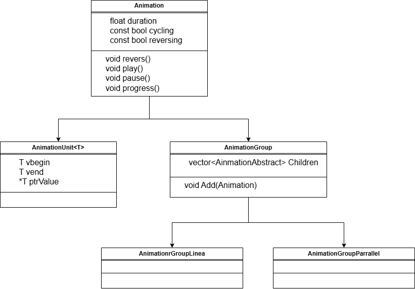

# Pamphlet_SVP

Création d'un jeu en C++ utilisant la bibliothèque SMLF pour le rendu

## Description 

Le jeu est inspiré de Paper please ([page steam](https://store.steampowered.com/app/239030/Papers_Please/)),
ainsi que de la pièce de théâtre Cyrano de Bergerac ([pdf de la pièce](https://www.theatre-classique.fr/pages/pdf/ROSTAND_CYRANO.pdf)).

Dans ce jeu, vous incarnez un missionnaire entre des tranchées responsable de la correction de poèmes.
Différents auteurs et autrices se doivent de passer vous voir avant d'envoyer leurs poèmes pour que vous les corrigiez.
De nombreuses fautes peuvent être présentes dans le poème, et il faut être attentif pour ne pas envoyer d'oeuvre malformée.

## Ambitions

Le projet peut être divisé en deux parties distinctes :
- La création du rendu du jeu et des mécaniques fondamentales.
- La gestion des poèmes et de leurs erreurs.

Cette dichotomie nous a permis de nous répartir les tâches sur le projet.

## Structure du projet

### Structure fondamentale
Bien que j'aimerais que ce ne soit pas le cas, il y a de grandes chances que cette partie évolue au cours du temps, en plus des ajouts en progression du projet

Le projet est divisé en plusieurs fichiers représentant plusieurs classes, chacun avec leurs rôles :
- Class Game : instance du jeu contenant toutes les informations et de nombreuses instances listées ci-dessous.
- Class GameObject : Objet dans le jeu avec une manipulation du joueur limitée.
- Class InteractibleObject - Class héritante de GameObject : Object du jeu avec une manipulation du joueur forte.
- Class TextureGestionner : Permet la gestion des Textures et des Sprites.
- Class Animation : Permet de créer des animations sur des propriétés de GameObject.
(Si j'ai le courage, je rajouterais deux schémas par la suite : un diagramme de classe et un diagramme de cas d'utilisation)

### Système d'annimation
Le système d'annimation n'étant plus une classe mais une structure de template [Composite](https://refactoring.guru/fr/design-patterns/composite), voici une image du schéma de la structure :

## Progression

### Ce que j'ai accompli (structure fondamentale)
- Implémentation des classes listées dans la partie Structure du projet.
- Affichage des premiers objets.
- Projet fonctionnel et sans bug (pour le moment).
- Système de prise d'un objet (retirer pour cause de bug).
- Création d'animation sur des propriétés élémentaires de GameObject (float, Vector2f et Angle).
- Gestion des textures basiques avec TextureGestionner.
- Achèvement du système d'animation pour faciliter la création et le lancement.
- Ré-implémentation du système de prise d'un objet (sans bug)
- Spécification des objets de base.
- Système d'animation complet

### Ce que je vise dans un future proche (aujourd'hui & demain)
- Finir la semaine sans bug
- Base graphique du jeu sur laquelle je peux m'appuyer pour le rendu final.

### Ce qu'il faut que j'implémente

- Différentes classes dérivées de GameObject & InteractibleObject (l'idée étant de les rendre abstraites)

### Ce que j'aimerai bien ajouter
- Animation non linéaire (sinusoïdal et quadratique)
- du fun

## Log du README
Modifié le 17/06 à 12:20 par JasonJ13 -> Création du fichier
Modifié le 18/06 à 10:30 par JasonJ13 -> avancement des tâches immédiates
