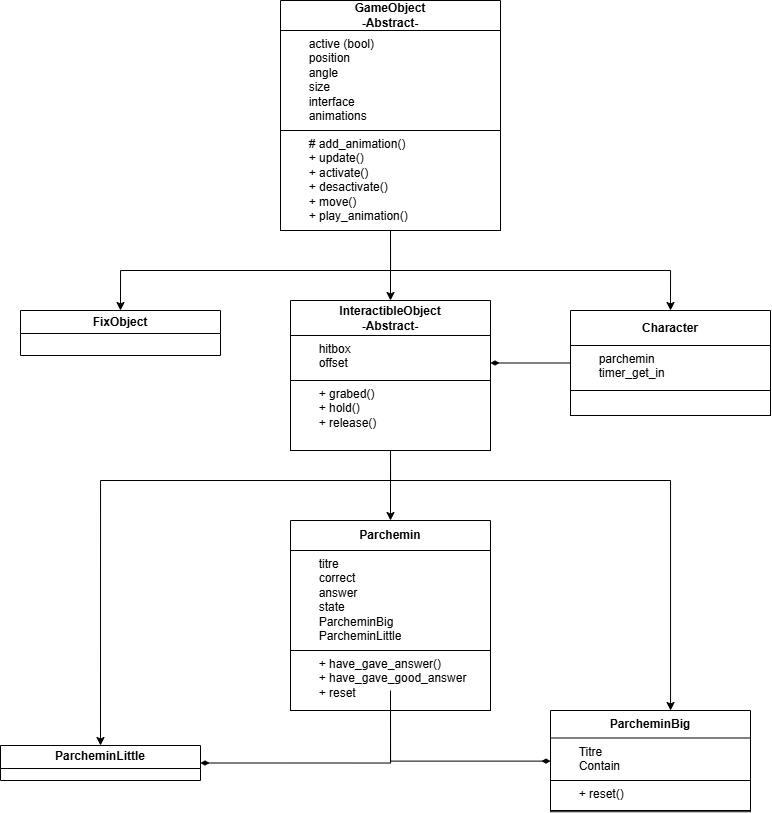
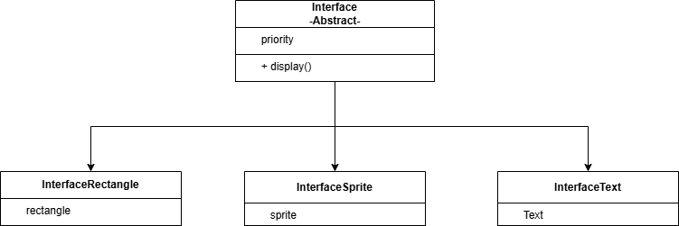
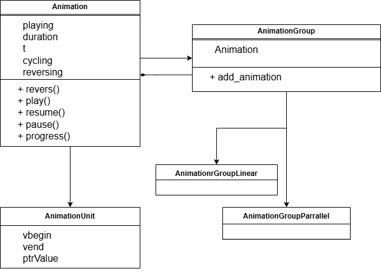

# Pamphlet_SVP

Création d'un jeu en C++ utilisant la bibliothèque SMLF pour le rendu

## Description 

Le jeu est inspiré de Paper please ([page steam](https://store.steampowered.com/app/239030/Papers_Please/)),
ainsi que de la pièce de théâtre Cyrano de Bergerac ([pdf de la pièce](https://www.theatre-classique.fr/pages/pdf/ROSTAND_CYRANO.pdf)).

Dans ce jeu, vous incarnez un missionnaire entre des tranchées responsable de la correction de poèmes.
Cyrano arrive pour vous donnez les différents poèmes.
Vous devez lui rendre les poèmes bien formés et jeter les poèmes avec des fautes

## Ambitions

Le projet peut être divisé en deux parties distinctes :
- La création du rendu du jeu et des mécaniques fondamentales.
- La gestion des poèmes et de leurs erreurs.

Cette dichotomie nous a permis de nous répartir les tâches sur le projet.

## Structure du projet

### Structure de rendu

Le projet est divisé en plusieurs fichiers représentant plusieurs classes et sous-classes, chacun avec leurs rôles :
- classe Game : instance du jeu contenant toutes les informations et de nombreuses instances listées ci-dessous.
- Famille de classe GameObject : Objet du jeu manipulable ou non.
- Class TextureGestionner : Permet la gestion des Textures et des Sprites.
- Famille de class Interface : Permet le rendu des objets
- Famille de class Animation : Permet de créer des animations sur des propriétés d'un objet de classe GameObject.

### Diagramme de classe de GameObject

### Diagramme de classe de Interface

### Diagramme de classe de Animation

## Log du README
Modifié le 17/06 à 12:20 par JasonJ13 -> Création du fichier
Modifié le 18/06 à 10:30 par JasonJ13 -> avancement des tâches immédiates
Modifié le 22/06 à 21:00 par JasonJ13 -> Suppression de la progression, rajout des diagrammes
